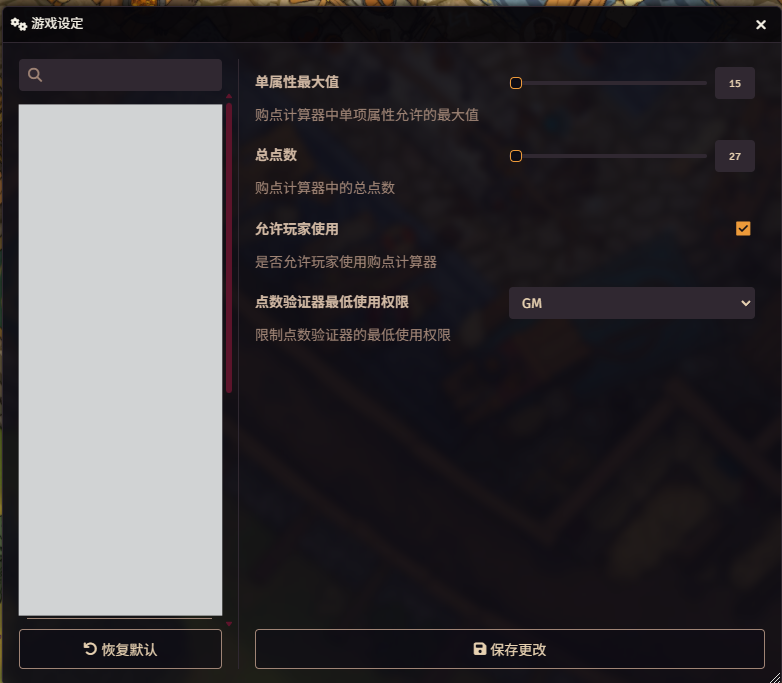
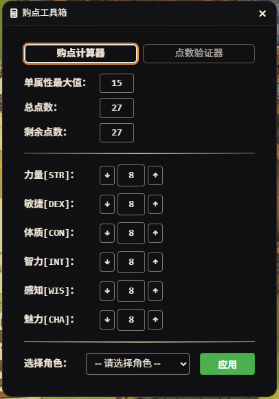
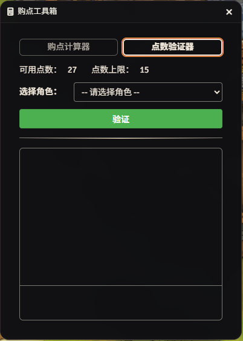
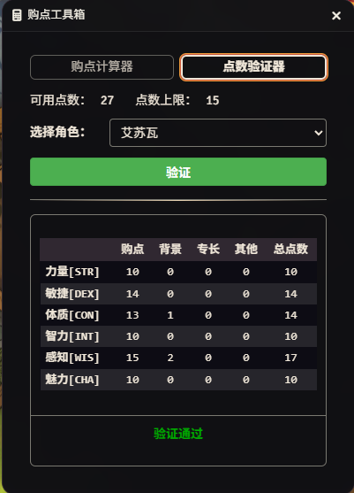
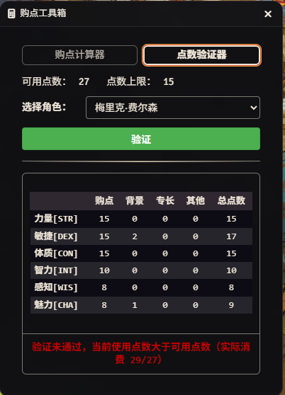

# 模组说明

### 兼容性
* **验证版本**：Foundry VTT 13 + D&D 5.2.x
* **语言支持**：仅支持中文

---

### 模组简介
本模组提供一个适用于D&D 5.5E的计算器工具，分为两个部分：
1. 购点计算器：玩家能够在购点计算器中进行角色属性购点，支持直接应用在玩家所拥有的角色卡中。GM可以在设置中调整购点规则。
2. 点数验证器：GM可以在点数验证器中直接验证任意一个世界中的角色卡当前的属性是否符合当前设置的购点标准。

### 详细功能介绍
点击界面左上角指示物控件中的计算器图标打开购点工具箱，默认将打开购点计算器。GM用户可以在购点计算器和点数验证其间切换，其余用户在默认设置下仅能使用购点计算器。

#### 模组相关设置
在配置设定中GM可以调整工具箱的相关设置，默认设置如下：

#### 购点计算器
在购点计算器中用户可以进行购点，剩余点数会自动进行计算。下侧的下拉菜单中会出现当前用户所拥有的所有角色卡，选定角色卡后点击应用，即可覆盖当前角色卡的属性点。属性点的覆盖仅会影响初始属性点，不会影响到通过背景，专长，魔法物品等方式额外添加的属性点。

#### 点数验证器
在点数验证器中可以对当前用户所拥有的PC角色卡进行审核，可用点数和点数上限均与购点计算器的设置一致。在下拉菜单中选择角色后，点击验证即可拆解该角色卡属性点的构成，并且给出验证结果。

验证器界面：

验证通过：

若购点点数正好等于可用点数且任何一个属性值不超过点数上限，则显示验证通过：

若出现以下情形之一，则验证不通过，下方文字部分会显示具体未通过的原因，包括以下几种情形：

1. 任意一个属性的购点属性值超过所允许的点数上限
2. 任意一个属性的购点属性值低于8
3. 当前购点属性所需的点数不等于当前可用点数

### 启动方法
模组安装并启用后，Foundry VTT 界面左侧的“Token 控件”菜单中会出现一个计算器图标。点击该图标即可开启或关闭计算器。玩家可以将计算器中显示的结果覆盖到自己所拥有的角色中。

### 反馈与协议
若在使用过程中发现任何问题或有改进建议，请联系邮箱 zhiyuan.gan@outlook.com。
任何人都可以自由使用、修改和分发本模组。如果你修改了本模组的代码并进行分发，你的作品也必须以 GPL v3 协议开源。
